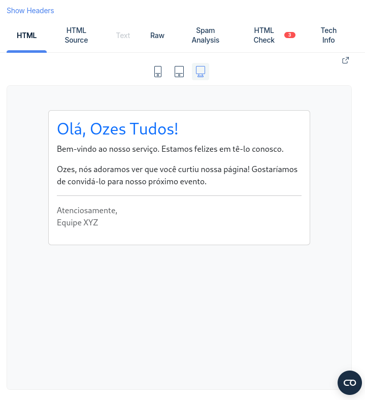

# Mail Node.js

Este projeto é uma aplicação Node.js que utiliza o Nodemailer para enviar e-mails através de um servidor SMTP. O projeto inclui a configuração básica e o uso de variáveis de ambiente para gerenciar credenciais de e-mail de forma segura.

## Pré-requisitos

Antes de executar este projeto, você precisará ter instalado:

- [Node.js](https://nodejs.org/) (v20 ou superior)
- [npm](https://www.npmjs.com/) (geralmente vem com o Node.js)

## Configuração

1. Clone o repositório:

```bash
git clone https://github.com/seu-usuario/<repositorio>.git
cd <diretorio>
```

2. Instale as dependências:

```bash
npm install
```

Crie um arquivo .env baseado no arquivo .env.example:

```bash
cp .env.example .env
```

Edite o arquivo .env com suas configurações de e-mail:

```
PORT=8888
EMAIL_HOST=sandbox.smtp.mailtrap.io
EMAIL_PORT=2525
EMAIL_SECURE=false
EMAIL_USER=your.user
EMAIL_PASS=your.password
```

Observação: Se você estiver usando o Gmail ou outro serviço, ajuste as configurações de EMAIL_HOST, EMAIL_PORT, EMAIL_USER e EMAIL_PASS conforme necessário.

Executando a Aplicação
Para iniciar o servidor, execute o seguinte comando:

```bash
npm start
```

A aplicação será executada na porta especificada (por padrão, 8888).

## Exemplo

<div style="display: flex; flex-direction: row; align-items: center; justify-content: center;">
    
</div>

## Enviando um E-mail

Para enviar um e-mail, faça uma solicitação POST para o endpoint /send-email com o seguinte corpo JSON:

```json
{
  "to": "destinatario@example.com",
  "subject": "Assunto do E-mail",
  "name": "Nome do Remetente",
  "message": "Conteúdo da mensagem"
}
```
